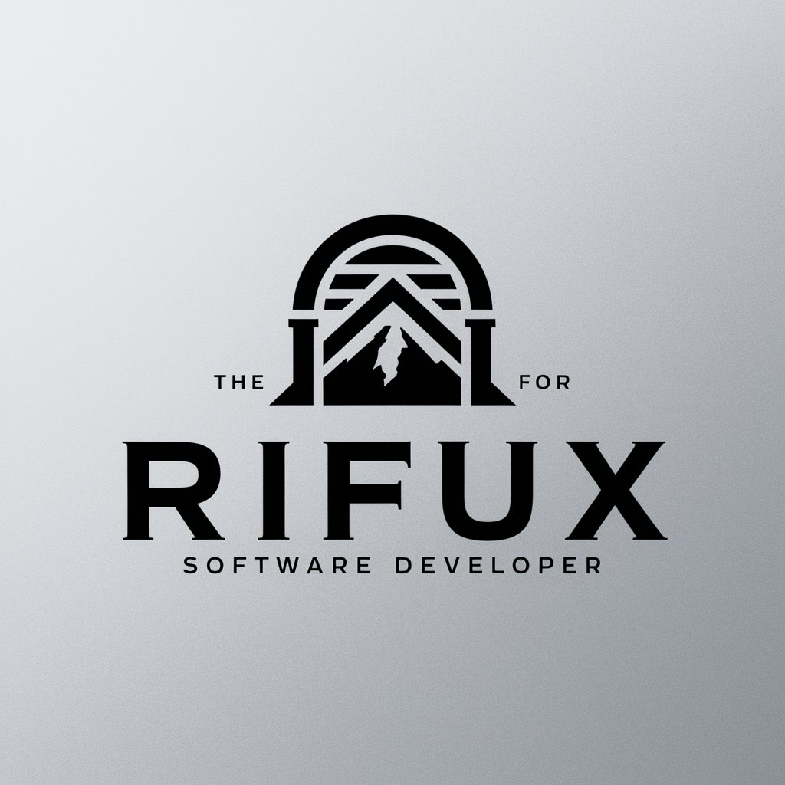

# Hello there! 👋

### My name is Vladimir Blinkov, and
I'm Golang newbie developer with a passion for building innovative solutions. 

> As an undergraduate student, I'm constantly learning and expanding my skills in various areas of technology.

### **About Me**

- **Golang Developer**: I'm dedicated to mastering Golang and using it to create efficient and scalable solutions.
- **Big Data Specialist**: I'm currently learning the ins and outs of big data analytics to help businesses make data-driven decisions.
- **Linux Enthusiast**: I'm excited to dive into the world of Linux. In my free time, I enjoy building and adapting kernels, Android ROMs; polishing my operating system skills and so on.

### **Skills**

- **Languages**: Golang, Python, C++, SQL, HTML, CSS, JS
- **Data Analytics**: Big Data, Business Analytics, Data Visualization
<!-- - **Mobile Development**: Android ROM Building, Custom ROMs -->

<!-- ### **Projects**

- **Android ROM Builds**: Check out my custom Android ROM builds and adaptations.
- **Golang Projects**: Explore my Golang projects, from data analytics tools to innovative applications. -->

### **Get in Touch**

<!-- **LinkedIn**: [LinkedIn Profile URL] -->
- **Email**: contact@rifux.dev
- **Telegram**: [@rifux_dev](https://t.me/rifux_dev)

### **Let's Connect** 💻

Feel free to reach out to me for collaborations, discussions, or just to chat about the latest tech trends. I'm always looking to learn from others and share my own knowledge 🤩

            
